# MyInterface
IAT 460 Final Project
Olivia Steed 
301421820

## What is it?
MyInterface is a Chrome extension that modifies the CSS and HTML of websites based on user input using the OpenAI API. It handles CSS changes the best, but can also inject certain HTML changes. 

## Using the extension
Because the extension is a prototype, it's not as easy as just downloading it from Chrome (yet). If you want to try out the extension yourself, you can follow the steps below. Please contact me if there are any issues.

### Extension set up
1. To run the extension you need to download the code and upload it to Chrome as an extension. You can do this by selecting the Extensions icon in the top right, selecting Manage Extensions, and then on the Extensions page, selecting Load Unpacked and uploading the MyInterface directory.
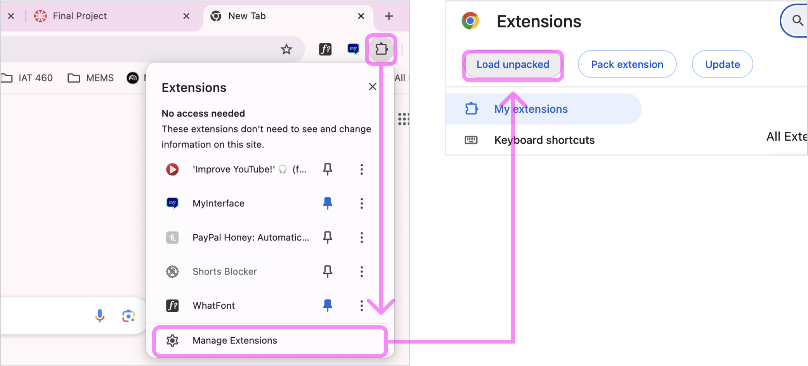

2. You will also need to open the MyInterface directory in a text editor so you can run the node server. I acknowledge that this is not ideal, but the current iteration is a prototype that I plan to continue working on so it can run in a browser independently. To have the icons display properly, you can change the image path to the ID of your local extension upload. This can be found on the Chrome Extensions page, and copied into the popup.html document, as seen below. 
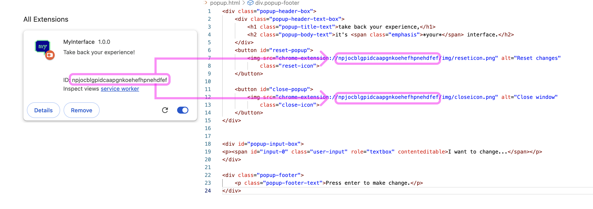

3. The extension requires CORS, Express, and Node to be installed, so ensure you have those dependecies installed and if not please install them in the console of your text editor.

4. Because MyInterface uses the OpenAI API, it requires an API key which I put in an environment variable file. I pasted my API key in the submission comments in Canvas (since you can't push it to Github). You will need to create a new file in the MyInterface directory called '.env' whose only content is 'OPENAI_API_KEY=(paste my API key here).' This is used by the server.js file to make an HTTP request to the API.

5. Before you run the extension, reset the server by running 'node server.js' in the console of your text editor. It should return a confirmation of a new run and the port it's running on, as in the screenshot below. If the extension stops responding and you are seeing errors on the Chrome Extensions page, type Ctrl+C in the console, and restart the server by running 'node server.js'.
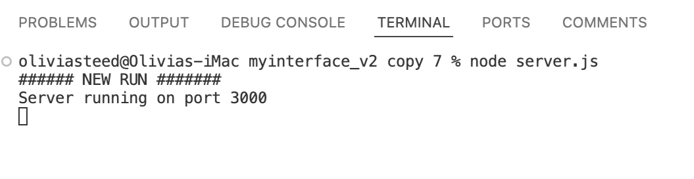

### Extension usage
6. After starting the server, refresh the extension on the Chrome extensions page. You can then start using the extension. It generally works better on lower-fidelity websites (ie. a WordPress recipe blog is going to work better than Facebook). The more dynamic elements and complexity a website has, the less change one line of CSS or HTML can accomplish, so keep this in mind when trying it out.

7. (bonus) To see the response from the OpenAI API that is being inserted into the page, you can open the Service Worker window from the Chrome extensions page so you can see the logging from the server.js file. You can also view the content.js logs in the Chrome console using Inspect.  
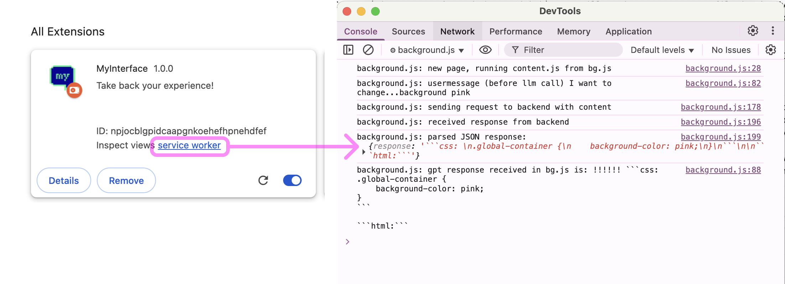
background.js console

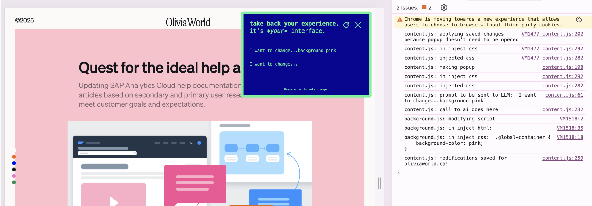
content.js console

Inserted content is identified by the 'data-injected=true' attribute, so can also be viewed in the Elements Inspect view.
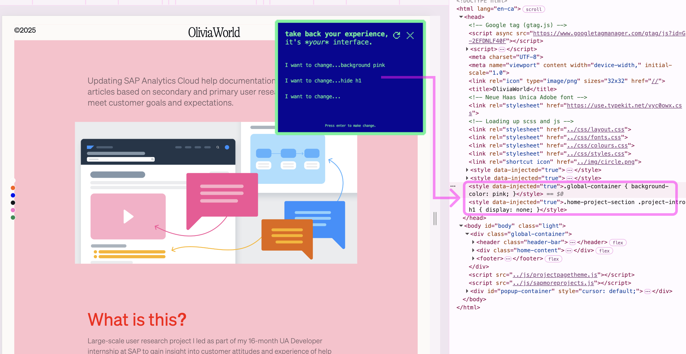

8. (note) Although code is usually inserted, it doesn't always show depending on how the specific website is implemented. Try rephrasing your prompt or adding specificity to increase odds of seeing results. (ie. specify 'text bigger' to 'p copy 2rem' will likely lead to more success).

If this seems like too much effort, you can watch the demo video here: https://youtu.be/POt1R2yg70g or look at the following usage examples.

## Usage examples
Here are some examples of ways you can use the extension. I ordered them from most to least reliable/easy to achieve. This varies because of the different ways websites are structured, and varying levels of interactivity and dynamic content. As a rule, the closer a website is to a static piece of HTML and CSS, the better the extension will work. Again I acknowledge this isn't ideal, but is a prototype to demonstrate that this concept is possible.

1. Changing colours 
- Changing the background colour is the most reliable change you can make and works nearly every time.
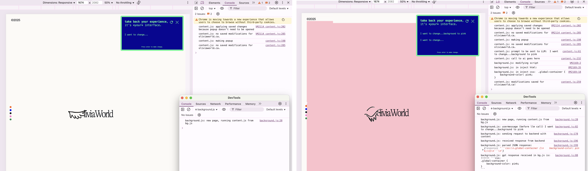

- You can also change text colours where specifying which element to change increases chances of success.
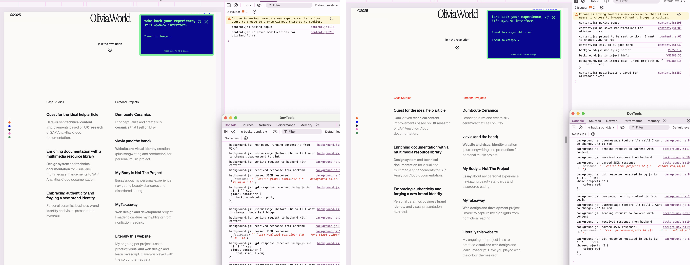

2. Increasing font size
- Increasing font size is also pretty reliable, but works better when the element or at least type of text (header vs copy) is specified.
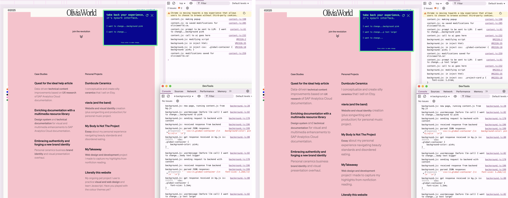

- You can also specify elements by the text they contain.
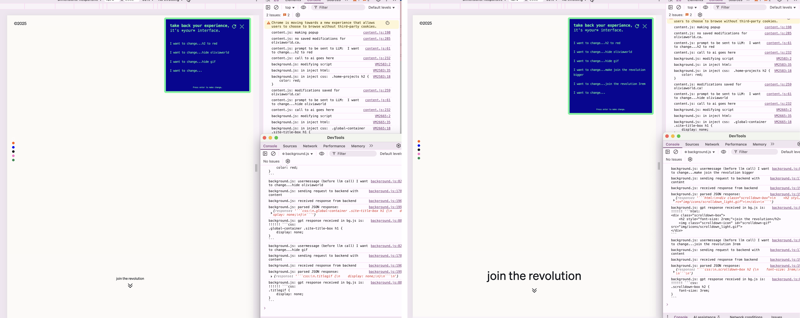

3. Hiding elements
- You can hide elements you don't like or want to see, for example something distracting or disturbing. This can work by element type (image) or contents (oliviaworld in this case).
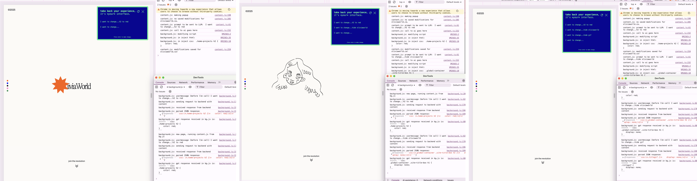

- You can hide images too.

- On some websites, you can hide ads.

4. Changing font
- You can change the font type and style of text elements. This works better if you identify them by element type or name. You can see how many tries this took to achieve because of the deep nesting of the text elements which have individual stylings applied to them. If something doesn't work rephrase and try again.

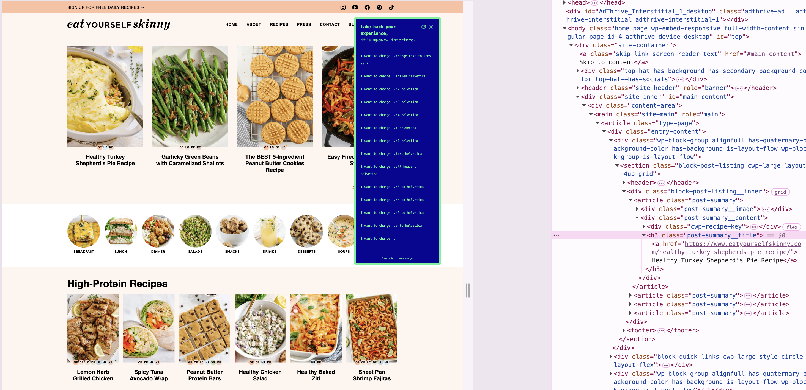
nested elements reduced effectiveness

5. General tomfoolery
- Part of the rationale for my project was to allow people to change web interfaces based on their accessibility needs which would include text size or colour, but another motivation was just to allow users to be in control. Designers can be very elitist about who is qualified to or deserves to do design work, but this extension allows users to be in charge, and in some cases to destroy the intent of the designer. Is that a bad thing? Is design sacred? These are questions using the extension can provoke as we explore the level of agency users should have over their personal experience, and how much aesthetic control a designer can maintain. It's like involving users as the randomness factor in a stochastic system.

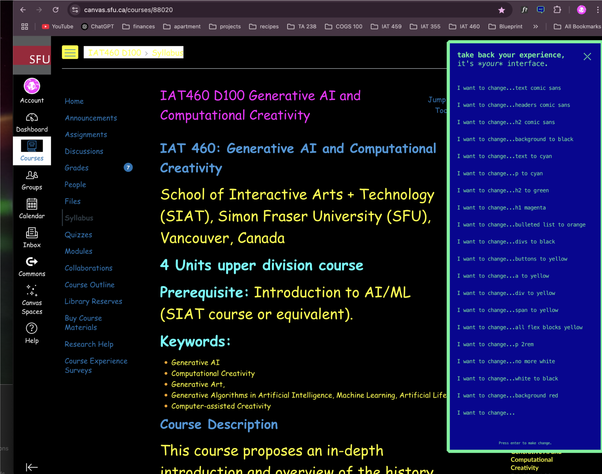
Who's to say this isn't better ui?

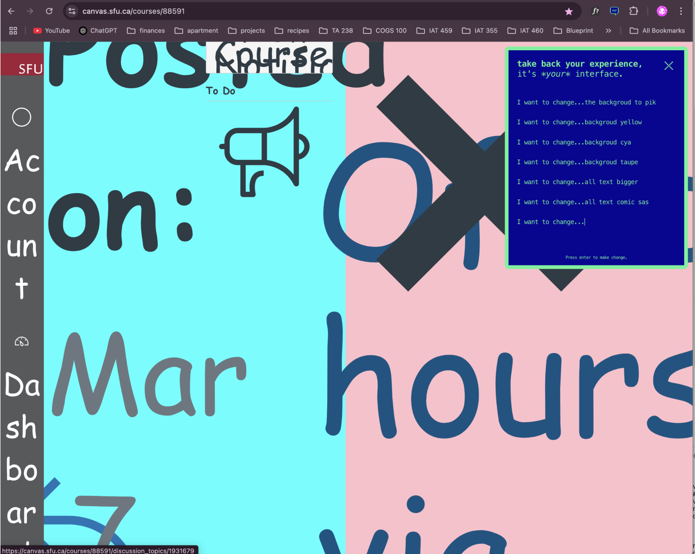
Do designers have a responsibility to keep work legible? How many degrees of freedom can you give users before they destroy the functionality of the system?